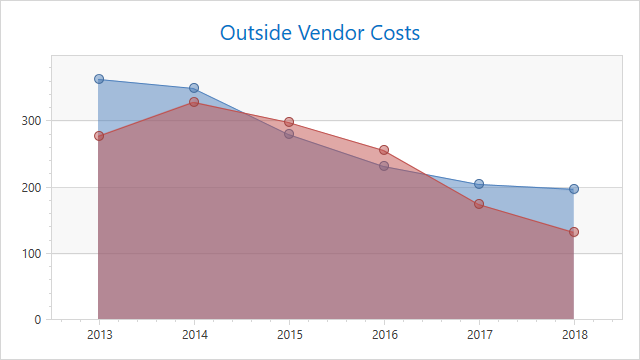

<!-- default badges list -->

<!-- default badges end -->
# How to create a 2D Area chart

The following example demonstrates how to create a 2D Area chart.

## Files to Review

* [Window1.xaml](./CS/Window1.xaml) 
* [Window1.xaml.cs](./CS/Window1.xaml.cs) / [Window1.xaml.vb](./VB/Window1.xaml.vb)

## Documentation

* [AreaSeries2D](https://docs.devexpress.com/WPF/DevExpress.Xpf.Charts.AreaSeries2D)

